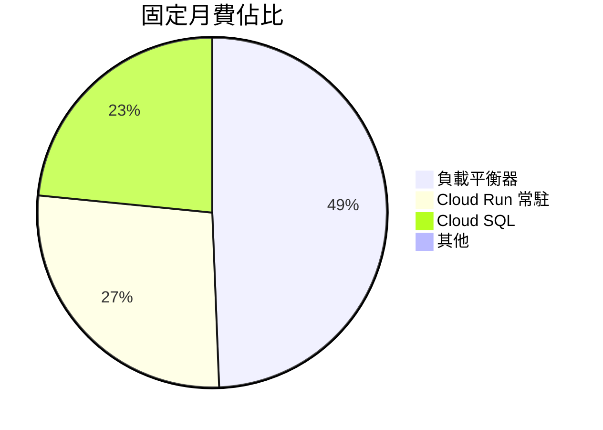
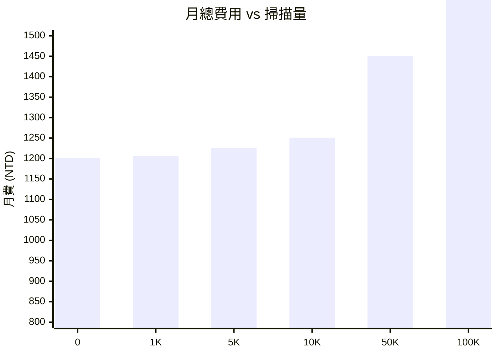

# WangSIS 成本估算報告

> 幣值: 新台幣 (NTD) | 匯率: 1 USD ≈ 32.5 NTD | 更新日期: 2026-03-12

---

## 1. 每月固定基礎建設費用

| 服務 | 供應商 | 用途 | 月費 (NTD) |
|------|--------|------|-----------|
| Cloud Run x2 | GCP | 前後端容器運行 (min=1, 常駐) | $325 |
| Cloud SQL | GCP | PostgreSQL 資料庫 (db-f1-micro) | $280 |
| 負載平衡器 | GCP | 自訂網域路由 + SSL 憑證 | $590 |
| Artifact Registry | GCP | Docker 映像儲存 (~1GB) | $3 |
| Secret Manager | GCP | 6 組 API 金鑰 | $0 |
| 網路流量 | GCP | 外送流量 (<1GB/月) | $0 |
| DNS 代管 | Cloudflare | 免費方案 | $0 |
| 網域名稱 | Cloudflare | dylan-reha-2gether.net | $3 |
| Email 服務 | Resend | 密碼重設信 (免費: 100封/日) | $0 |
| 程式碼托管 | GitHub | 4 Repos (免費方案) | $0 |
| 專案管理 | Jira | 免費方案 (10人) | $0 |
| **固定月費合計** | | | **$1,201** |

---

## 2. 每次掃描變動費用

### 2.1 AI 辨識成本明細

| 階段 | 模型 | 用量 | 單價 | 費用 (USD) |
|------|------|------|------|-----------|
| 第一階段 (通用辨識) | Gemini 2.5 Flash Lite | ~330 input tokens | $0.075/1M | $0.000025 |
| | | ~170 output tokens | $0.30/1M | $0.000051 |
| 第二階段 (供應商專屬) | Gemini 2.5 Flash Lite | ~350 input tokens | $0.075/1M | $0.000026 |
| | | ~170 output tokens | $0.30/1M | $0.000051 |
| **每次掃描合計** | | | | **$0.000153 USD** |

> 換算: $0.000153 USD × 32.5 = **$0.0050 NTD/次**

### 2.2 辨識時間

| 供應商類型 | 辨識階段 | 平均時間 | 成本 (NTD) |
|-----------|---------|---------|-----------|
| 已知供應商 (PANJIT, SEMIHOW 等) | 兩階段 | ~3.0 秒 | $0.0050 |
| 未知供應商 | 單階段 | ~1.5 秒 | $0.0025 |

> **注意：** 已設定 Cloud Run min-instances=1 消除冷啟動延遲，並重用 Gemini API 連線。

---

## 3. 月費估算（依掃描量）

| 月掃描量 | AI 費用 (NTD) | 固定費用 (NTD) | **月總費用** | 每次掃描均攤成本 |
|---------|--------------|--------------|------------|---------------|
| 0 次 | $0 | $1,201 | **$1,201** | - |
| 100 次 | $0.50 | $1,201 | **$1,202** | $12.02 |
| 500 次 | $2.50 | $1,201 | **$1,204** | $2.41 |
| 1,000 次 | $5.00 | $1,201 | **$1,206** | $1.21 |
| 5,000 次 | $25.00 | $1,201 | **$1,226** | $0.25 |
| 10,000 次 | $50.00 | $1,201 | **$1,251** | $0.13 |
| 50,000 次 | $250.00 | $1,201 | **$1,451** | $0.03 |
| 100,000 次 | $500.00 | $1,201 | **$1,701** | $0.02 |

---

## 4. 年度費用估算

| 情境 | 月掃描量 | 年費 (NTD) | 備註 |
|------|---------|-----------|------|
| 低用量 | ~500 次/月 | **$14,448** | 小型倉庫 |
| 中用量 | ~5,000 次/月 | **$14,712** | 一般營運 |
| 高用量 | ~50,000 次/月 | **$17,412** | 大量收貨 |

---

## 5. GCP 免費額度預估

GCP 新帳號提供 **$300 USD ($9,750 NTD) 免費額度**，有效期 90 天。

| 項目 | 月費 (NTD) | 說明 |
|------|-----------|------|
| Cloud Run (min=1, 2 服務) | $325 | 常駐實例消除冷啟動 |
| Cloud SQL | $280 | PostgreSQL db-f1-micro |
| 負載平衡器 | $590 | 自訂域名 + SSL |
| 其他 | $6 | Registry + 域名 |
| **月合計** | **$1,201** | |

### 免費額度可使用時間

| 情境 | 月費 (NTD) | 可用月數 | 到期日（估） |
|------|-----------|--------|-----------|
| 僅基礎建設 | $1,201 | **8.1 個月** | 2027-01 |
| 低用量 (500次/月) | $1,204 | **8.1 個月** | 2027-01 |
| 中用量 (5K次/月) | $1,226 | **8.0 個月** | 2026-12 |
| 高用量 (50K次/月) | $1,451 | **6.7 個月** | 2026-10 |

> **注意：** GCP 免費試用期為 90 天（至 2025-09-25），但 $300 USD 額度可用至花完。部分服務（Cloud Run、Cloud SQL）在免費額度用完後仍有 Always Free 額度。
>
> 帳號建立日期: 2025-06-27

---

## 6. 成本優化建議

| 項目 | 現況 | 可優化方案 | 預估節省 |
|------|------|----------|---------|
| 負載平衡器 | $590/月 | 改用 Cloudflare Tunnel (免費) | -$590/月 |
| Cloud SQL | $280/月 | 改用 Cloud Run + SQLite (免費) | -$280/月 |
| AI 模型 | 兩階段辨識 | 已知供應商可跳過第一階段 | -50% AI 費用 |

> **最佳化後固定月費可降至 ~$6 NTD/月**（僅剩網域 + 儲存費用），但需要重新架構。

---

## 7. 與同類產品比較

| 方案 | 月費 (NTD) | 每次掃描 | 備註 |
|------|-----------|---------|------|
| **WangSIS (本系統)** | **$876** | **$0.005** | 自建，完全客製化 |
| SAP WMS | ~$30,000+ | 含在月費 | 企業級，功能過多 |
| 倉庫王 | ~$5,000+ | 含在月費 | 台灣本土方案 |
| 手動 Excel | $0 | $0 | 人力成本高，易出錯 |
