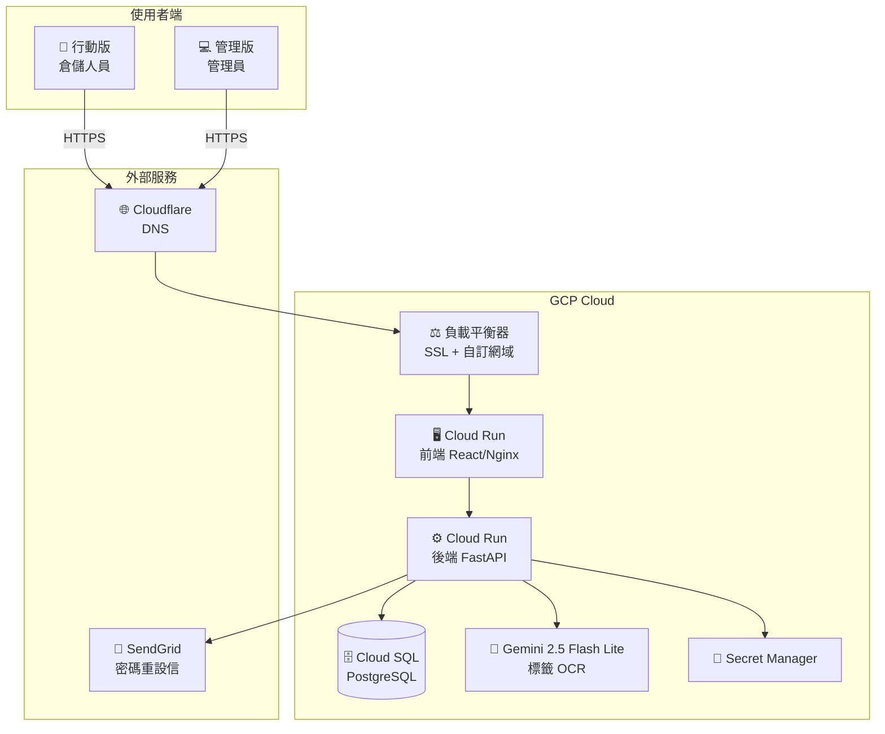
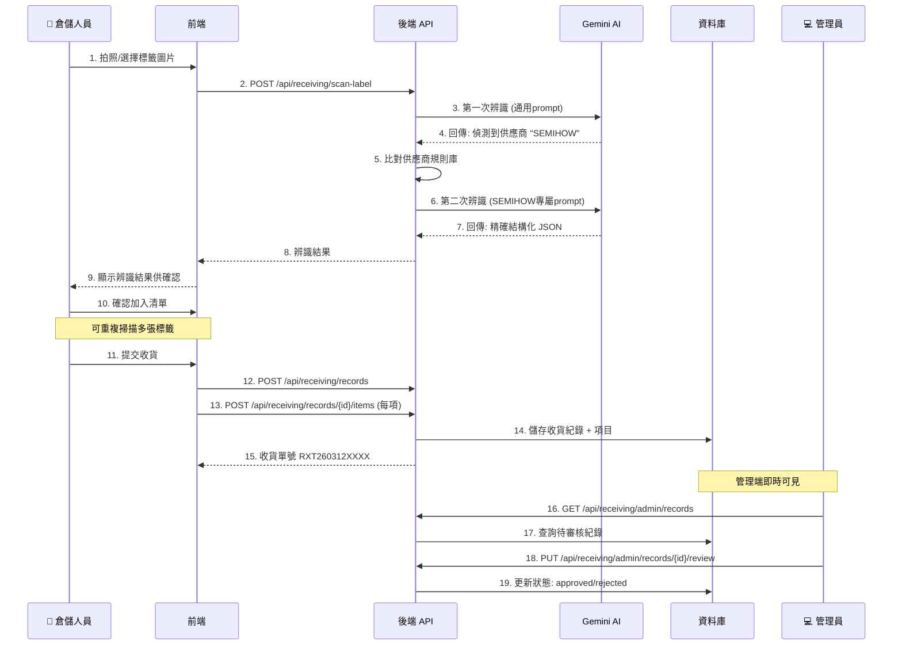
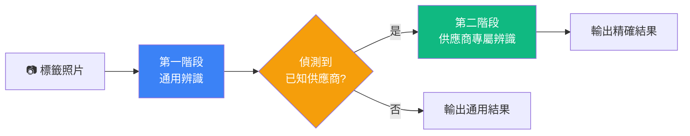
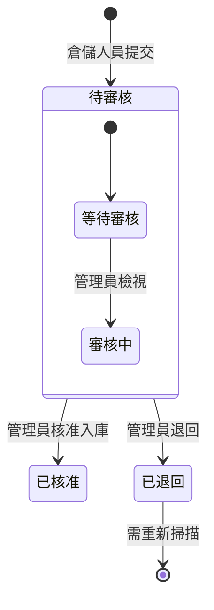
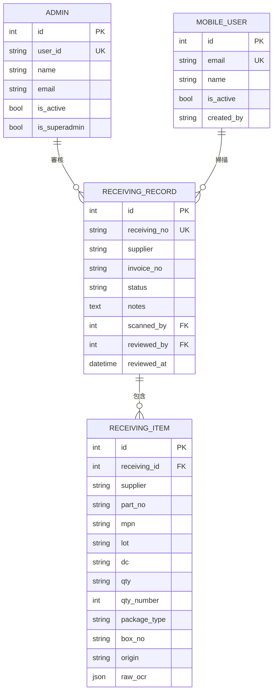

# WangSIS 產品需求文件 (PRD)

> 版本: 1.0 | 更新日期: 2026-03-12 | 作者: Dylan Xie

---

## 1. 產品概述

WangSIS 是一套專為半導體/電子零件倉儲設計的管理系統，提供 **行動版掃描收貨** 與 **管理端審核庫存** 兩大核心功能。

### 1.1 目標用戶

| 角色 | 說明 | 使用介面 |
|------|------|---------|
| 倉儲人員 | 使用手機掃描標籤、提交收貨紀錄 | 行動版 (m.dylan-reha-2gether.net) |
| 管理員 | 審核收貨、管理帳號、查看報表 | 管理版 (admin.dylan-reha-2gether.net) |

### 1.2 核心價值

- **AI 自動辨識**: 拍照即自動辨識標籤，無需手動輸入
- **供應商智慧匹配**: 根據供應商自動套用專屬解碼規則
- **即時同步**: 行動端提交後，管理端即時可審核
- **成本極低**: 每次掃描僅 $0.0046 NTD

---

## 2. 系統架構

---

## 3. 功能規格

### 3.1 標籤掃描收貨流程

### 3.2 AI 辨識兩階段流程

### 3.3 支援供應商與解碼規則

| 供應商 | 類別 | 特殊解碼規則 |
|--------|------|-------------|
| **PANJIT (強茂)** | 二極體 | TYPE: R1=7"Reel, 00001首碼0=無鹵。LOT前4碼=YYMMDD。DC=YYWW |
| **CVILUX (瀚荃)** | 連接器 | LOT: B51G-YYMMDDSN。DC 由 LOT 月份換算 |
| **SYNC (擎力)** | IC/MOSFET | 標準欄位。DATE CODE 可能使用週期碼 |
| **SEMIHOW** | IC | BOX NO 行含兩值：箱號 + LOT/DC碼 (YWWXG格式) |
| **JieJie Micro (捷捷微)** | 微電子 | DC-LOT: YYWW+廠碼。QR含管線分隔資料 |
| **uPI SEMI (力智)** | IC | D/C 使用週期碼表 (A-z對應1-53週) |

### 3.4 收貨紀錄狀態流

---

## 4. 資料模型

---

## 5. API 端點

### 5.1 行動版 API

| 方法 | 路徑 | 說明 | 認證 |
|------|------|------|------|
| POST | `/api/mobile/auth/login` | 登入 | 無 |
| POST | `/api/mobile/auth/forgot-password` | 忘記密碼 | 無 (IP限速) |
| GET | `/api/mobile/auth/me` | 取得個人資料 | Mobile JWT |
| POST | `/api/receiving/scan-label` | 掃描標籤 (AI辨識) | Mobile JWT |
| POST | `/api/receiving/records` | 建立收貨紀錄 | Mobile JWT |
| POST | `/api/receiving/records/{id}/items` | 新增收貨項目 | Mobile JWT |
| GET | `/api/receiving/my-records` | 我的收貨紀錄 | Mobile JWT |

### 5.2 管理版 API

| 方法 | 路徑 | 說明 | 認證 |
|------|------|------|------|
| POST | `/api/auth/login` | 管理員登入 | 無 |
| GET | `/api/admins/` | 管理員列表 | Admin JWT |
| GET | `/api/mobile-users/` | 行動用戶列表 | Admin JWT |
| GET | `/api/receiving/admin/records` | 所有收貨紀錄 | Admin JWT |
| GET | `/api/receiving/admin/records/{id}` | 收貨詳情 | Admin JWT |
| PUT | `/api/receiving/admin/records/{id}/review` | 審核收貨 | Admin JWT |

---

## 6. 安全機制

| 機制 | 說明 |
|------|------|
| JWT 認證 | HS256 + 24小時過期，admin/mobile 分離 |
| 密碼加密 | bcrypt 雜湊 |
| IP 限速 | 忘記密碼: 5次/分鐘/IP |
| UAT 白名單 | `X-UAT-Token` header 繞過限速 |
| 帳號列舉防護 | 忘記密碼統一回覆，不洩漏帳號是否存在 |
| HTTPS | Google-managed SSL 憑證 |
| Secret Manager | API 金鑰存放 GCP Secret Manager |

---

## 7. 非功能性需求

| 項目 | 規格 |
|------|------|
| 可用性 | 99.9% (Cloud Run SLA) |
| 回應時間 | API < 500ms (不含 AI 辨識) |
| AI 辨識時間 | < 3 秒 (Gemini 2.5 Flash Lite) |
| 支援裝置 | iOS Safari, Android Chrome |
| 語系 | 繁體中文 (zh-TW) |
| 最大圖片 | 10MB |
