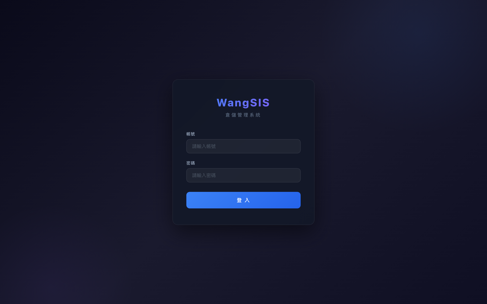
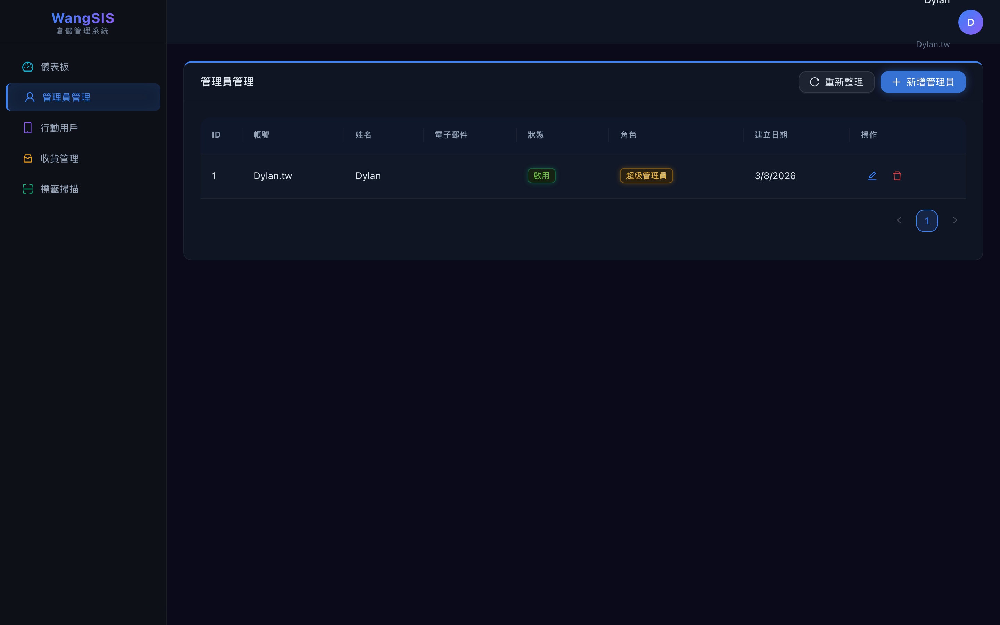
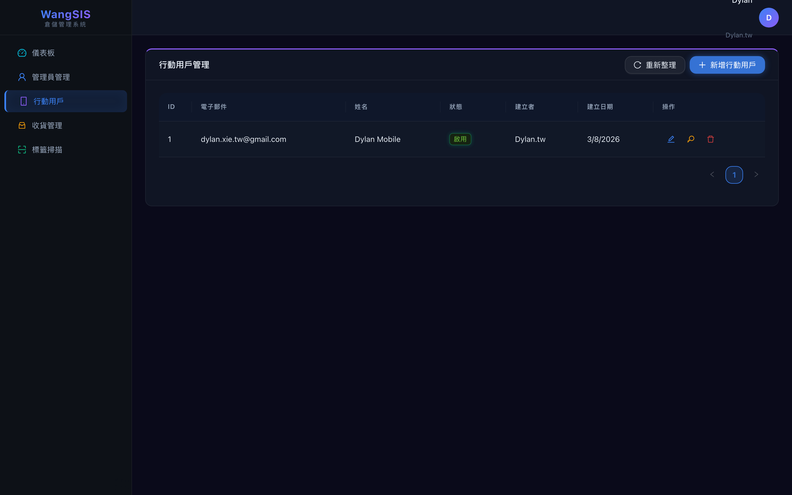
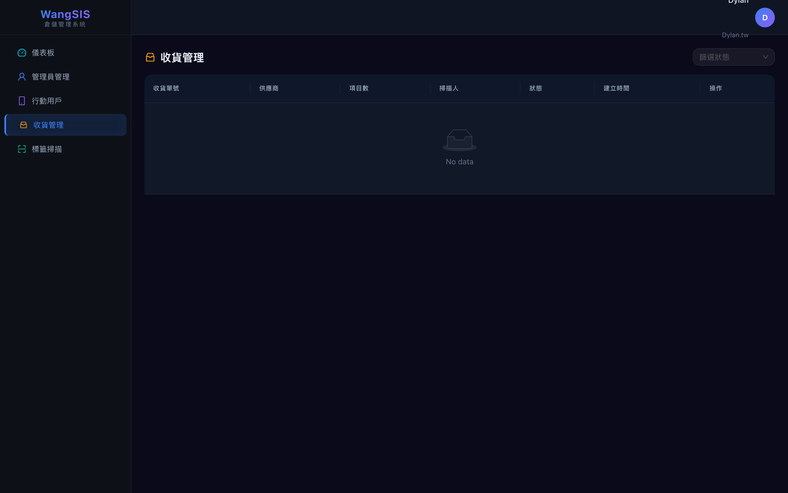
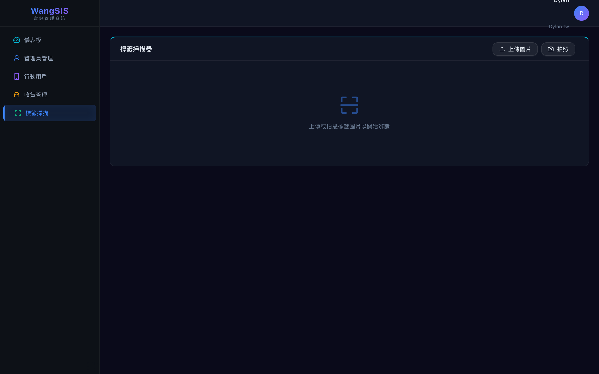
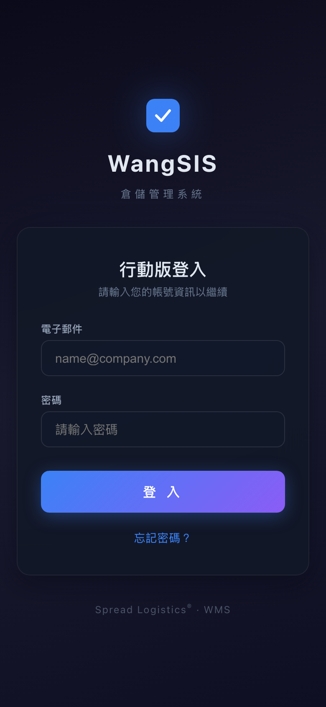

# WangSIS 測試指南

> 版本: 1.1 | 最後更新: 2026-03-17

---

## 1. 系統網址

| 服務 | 網址 |
|------|------|
| 管理後台 | https://admin.dylan-reha-2gether.net |
| 行動版 | https://m.dylan-reha-2gether.net/m/login |
| API 服務 | https://api-admin.dylan-reha-2gether.net/api |
| API 健康檢查 | https://api-admin.dylan-reha-2gether.net/api/health |
| API 文件 (Swagger) | https://api-admin.dylan-reha-2gether.net/docs |

---

## 2. 測試帳號

| 角色 | 帳號 | 密碼 | 登入位置 |
|------|------|------|----------|
| 超級管理員 | `Dylan.tw` | `111111` | 管理後台 `/login` |
| 行動用戶 | *(由管理員建立)* | *(系統自動產生)* | 行動版 `/m/login` |

---

## 3. 測試流程

### 3.1 管理員登入

1. 前往 https://admin.dylan-reha-2gether.net/login
2. 輸入帳號 `Dylan.tw`，密碼 `111111`
3. 預期結果：成功進入管理後台，左側顯示功能選單

<p align="center">
  
</p>

---

### 3.2 管理員管理

登入後預設進入此頁面，顯示所有管理員帳號。

- [ ] 表格顯示帳號、姓名、狀態、角色
- [ ] 可新增管理員
- [ ] 可編輯 / 刪除管理員

<p align="center">
  
</p>

---

### 3.3 建立行動用戶

左側選單 → **行動用戶** → 點擊 **新增行動用戶**

- [ ] 輸入電子郵件與姓名
- [ ] 系統產生隨機密碼，頁面顯示密碼
- [ ] 可編輯、重設密碼、刪除用戶
- **請記錄產生的密碼**，後續行動版測試需要

<p align="center">
  
</p>

---

### 3.4 收貨管理

左側選單 → **收貨管理**

- [ ] 表格顯示所有收貨紀錄（收貨單號、供應商、項目數、掃描人、狀態）
- [ ] 篩選狀態：全部 / 待審核 / 已核准 / 已退回
- [ ] 點擊「查看」→ 顯示收貨紀錄詳情及所有掃描項目
- [ ] 可核准 (Approve) → 狀態變為綠色
- [ ] 可退回 (Reject) → 可填寫退回原因

<p align="center">
  
</p>

---

### 3.5 供應商規則管理

> **注意：此功能尚未部署至正式環境，需部署後測試**

左側選單 → **供應商規則**

- [ ] 表格顯示 6 個預設供應商 (PANJIT, CVILUX, SYNC, SEMIHOW, JIEJIE, UPI)
- [ ] 點擊展開可看到完整 Prompt 內容
- [ ] 可新增 / 編輯 / 停用 / 刪除規則
- [ ] **測試遊樂場**：切換分頁 → 上傳標籤圖片 → 顯示 AI 辨識結果 + 匹配規則 + 耗時

---

### 3.6 標籤掃描

左側選單 → **標籤掃描**

- [ ] 點擊「上傳圖片」或「拍照」
- [ ] AI 辨識後顯示結構化結果

<p align="center">
  
</p>

---

### 3.7 行動版登入

1. 前往 https://m.dylan-reha-2gether.net/m/login
2. 輸入步驟 3.3 建立的電子郵件與密碼
3. 預期結果：成功進入行動版首頁

<p align="center">
  
</p>

---

### 3.8 掃描收貨（行動版核心流程）

首頁 → **掃描收貨**

1. 點擊掃描 → 拍照或選擇標籤圖片
2. AI 辨識中顯示 Loading 動畫（約 2-3 秒）
3. 辨識完成顯示結構化結果（供應商、料號、LOT、數量等）

驗證項目：
- [ ] 點擊「加入清單」→ 項目加入列表
- [ ] 可繼續掃描多張標籤
- [ ] 可刪除清單中的錯誤項目（點擊 ✕）
- [ ] 點擊「提交收貨」→ 顯示收貨單號 (RXTyymmddNNNN)
- [ ] 提交後可返回首頁或繼續掃描

---

### 3.9 忘記密碼

1. 行動版登入頁 → 點擊 **忘記密碼？**
2. 輸入電子郵件 → 送出

驗證項目：
- [ ] 顯示「新密碼已寄送至信箱」
- [ ] 收到 Resend 寄出的密碼重設郵件
- [ ] 連續送出 5 次以上 → 顯示「請求過於頻繁」(HTTP 429)

> **UAT 繞過限流**：API 請求加上 Header `X-UAT-Token: wangsis-uat-2026`

---

## 4. API 快速測試

### 健康檢查

```bash
curl https://api-admin.dylan-reha-2gether.net/api/health
# 預期: {"status":"ok"}
```

### 管理員登入

```bash
curl -X POST https://api-admin.dylan-reha-2gether.net/api/auth/login \
  -H "Content-Type: application/json" \
  -d '{"user_id":"Dylan.tw","password":"111111"}'
# 預期: 回傳 access_token
```

### 查詢供應商規則（需 Token）

```bash
TOKEN="<上一步取得的 access_token>"
curl https://api-admin.dylan-reha-2gether.net/api/supplier-rules/ \
  -H "Authorization: Bearer $TOKEN"
# 預期: 回傳供應商規則列表
```

### 行動版登入

```bash
curl -X POST https://api-admin.dylan-reha-2gether.net/api/mobile/auth/login \
  -H "Content-Type: application/json" \
  -d '{"email":"<mobile_user_email>","password":"<password>"}'
```

### 忘記密碼（含 UAT 繞過）

```bash
curl -X POST https://api-admin.dylan-reha-2gether.net/api/mobile/auth/forgot-password \
  -H "Content-Type: application/json" \
  -H "X-UAT-Token: wangsis-uat-2026" \
  -d '{"email":"<mobile_user_email>"}'
```

---

## 5. 注意事項

| 項目 | 說明 |
|------|------|
| UI 語言 | 繁體中文 |
| AI 模型 | Gemini 2.5 Flash Lite |
| 掃描時間 | 約 2 秒（已知供應商兩階段） |
| 郵件服務 | Resend（永久免費 100封/天、3,000封/月） |
| 供應商規則 | 修改後下次掃描即時生效 |
| 自訂域名 | 需在 Resend Dashboard 設定 DNS 記錄 |
