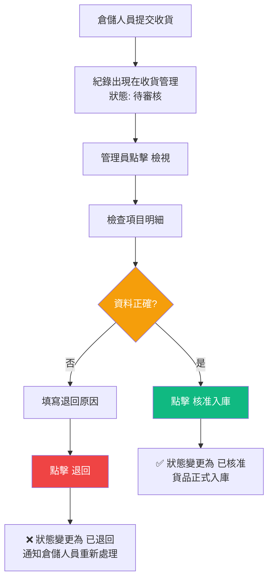

# WangSIS 管理版使用者指南

> 適用對象：系統管理員 | 版本: 1.0

---

## 1. 登入系統

1. 開啟瀏覽器，前往 **admin.dylan-reha-2gether.net**
2. 輸入 **使用者帳號** 與 **密碼**
3. 點擊 **登入**

---

## 2. 側邊欄功能總覽

```
┌──────────────────────────────────────────────┐
│ ┌──────────┐                                 │
│ │ WangSIS  │                                 │
│ │ 倉儲管理  │              管理員名稱  帳號    │
│ ├──────────┤  ┌──────────────────────────┐   │
│ │ 📊 儀表板 │  │                          │   │
│ │ 👤 管理員 │  │      主要內容區域         │   │
│ │ 📱 行動用戶│  │                          │   │
│ │ 📦 收貨管理│  │                          │   │
│ │ 🔍 標籤掃描│  │                          │   │
│ └──────────┘  └──────────────────────────┘   │
└──────────────────────────────────────────────┘
```

| 功能 | 說明 |
|------|------|
| 儀表板 | 系統總覽 (開發中) |
| 管理員管理 | 新增/編輯/停用管理員帳號 |
| 行動用戶 | 新增/編輯倉儲人員帳號、密碼重設 |
| **收貨管理** | **審核倉儲人員提交的收貨紀錄** |
| 標籤掃描 | 管理端標籤辨識測試工具 |

---

## 3. 收貨管理（核心流程）

### 3.1 查看收貨紀錄

進入 **「收貨管理」** 頁面，可看到所有收貨紀錄列表：

```
┌───────────────────────────────────────────────────────────┐
│ 📦 收貨管理                              [篩選狀態 ▾]     │
├──────────┬────────┬──────┬──────┬──────┬─────────────────┤
│ 收貨單號  │ 供應商  │ 項目數│ 掃描人│ 狀態  │ 建立時間        │
├──────────┼────────┼──────┼──────┼──────┼─────────────────┤
│ RXT26... │SEMIHOW │ 3 項 │ Dylan│ 待審核│ 2026/03/12 14:30│
│ RXT26... │PANJIT  │ 5 項 │ Amy  │ 已核准│ 2026/03/11 09:15│
│ RXT26... │CVILUX  │ 1 項 │ Dylan│ 已退回│ 2026/03/10 16:45│
└──────────┴────────┴──────┴──────┴──────┴─────────────────┘
```

**狀態篩選：**
- **待審核**（橘色）— 等待管理員審核
- **已核准**（綠色）— 已審核通過入庫
- **已退回**（紅色）— 審核不通過

### 3.2 審核收貨紀錄

點擊 **「檢視」** 按鈕開啟詳情視窗：

```
┌─────────────────────────────────────────────────────────┐
│ 收貨詳情 — RXT2603120001                                 │
├─────────────────────────────────────────────────────────┤
│ 收貨單號: RXT2603120001    供應商: SEMIHOW                │
│ 掃描人:   Dylan            狀態: 待審核                   │
│ 建立時間: 2026/03/12 14:30                               │
│                                                         │
│ 收貨項目 (3 項)                                          │
│ ┌────────┬──────────────┬──────┬──────┬──────┬────────┐ │
│ │ 供應商  │ 料號          │ LOT  │ D/C  │ 數量 │ 包裝   │ │
│ ├────────┼──────────────┼──────┼──────┼──────┼────────┤ │
│ │SEMIHOW │HCS65R210S-FM │526Tg │526Tg │6K    │TO-220FS│ │
│ │SEMIHOW │HCU6N70S_Green│726WG │726WG │12000 │TO-251B │ │
│ │PANJIT  │ES1JF         │8701..│8267  │84000 │Reel    │ │
│ └────────┴──────────────┴──────┴──────┴──────┴────────┘ │
│                                                         │
│ ┌──────────────────────────┐                            │
│ │ 審核備註（選填）           │                            │
│ └──────────────────────────┘                            │
│                                                         │
│              [❌ 退回]  [✅ 核准入庫]                     │
└─────────────────────────────────────────────────────────┘
```

**審核操作：**
1. 檢查每個項目的料號、LOT、數量是否正確
2. 可填寫審核備註（選填）
3. 點擊 **「核准入庫」** 或 **「退回」**

---

## 4. 行動用戶管理

### 4.1 新增倉儲人員帳號

1. 進入 **「行動用戶」** 頁面
2. 點擊 **「新增用戶」**
3. 填入 **電子郵件** 與 **姓名**
4. 系統自動產生隨機密碼
5. 密碼會顯示在畫面上，並透過 SendGrid 寄送至信箱

### 4.2 重設密碼

1. 在用戶列表點擊 **「重設密碼」**
2. 系統產生新密碼
3. 新密碼透過 Email 寄送給用戶
4. 畫面顯示 Email 發送狀態（成功/失敗 + Message ID）

---

## 5. 管理員管理

- **新增管理員**: 設定帳號、密碼、姓名、Email
- **編輯管理員**: 修改姓名、Email、密碼、啟用/停用
- **刪除管理員**: 無法刪除自己的帳號

---

## 6. 收貨審核流程圖



---

## 7. 系統效能參考

| 操作 | 預估時間 | 備註 |
|------|---------|------|
| 登入 | < 1 秒 | |
| 載入收貨列表 | < 1 秒 | |
| 載入收貨詳情 | < 1 秒 | |
| 審核操作 | < 1 秒 | |
| AI 標籤辨識 | 1.5 - 3 秒 | 已知供應商兩階段，未知供應商單階段 |
