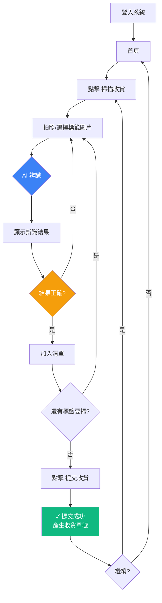

# WangSIS 行動版使用者指南

> 適用對象：倉儲人員 | 版本: 1.0

---

## 1. 登入系統

1. 開啟手機瀏覽器，前往 **m.dylan-reha-2gether.net**
2. 輸入管理員提供的 **電子郵件** 與 **密碼**
3. 點擊 **登入**

<p align="center">
  
</p>

> **忘記密碼？** 點擊「忘記密碼？」，輸入電子郵件，系統將寄送新密碼至信箱。

---

## 2. 首頁功能

登入後進入首頁，可看到四個功能按鈕：

```
┌─────────────────────────┐
│  WangSIS 行動版          │
│                         │
│  ┌──────┐  歡迎回來      │
│  │  DX  │  Dylan Xie    │
│  └──────┘  test@mail.com │
│                         │
│  快速功能                │
│  ┌─────────┬─────────┐  │
│  │ 📷      │ 📋      │  │
│  │ 掃描收貨 │ 收貨紀錄 │  │
│  ├─────────┼─────────┤  │
│  │ 🔑      │ ⚙️      │  │
│  │ 密碼變更 │ 設定    │  │
│  └─────────┴─────────┘  │
└─────────────────────────┘
```

---

## 3. 掃描收貨（核心流程）

### 步驟一：進入掃描頁面

點擊首頁 **「掃描收貨」** 按鈕。

### 步驟二：拍照或選擇圖片

```
┌─────────────────────────┐
│  ← 標籤掃描收貨          │
│                         │
│  ┌───────────────────┐  │
│  │                   │  │
│  │       📷          │  │
│  │  點擊拍照或選擇圖片 │  │
│  │                   │  │
│  └───────────────────┘  │
│                         │
│  ┌───────────────────┐  │
│  │   📷 掃描標籤      │  │
│  └───────────────────┘  │
└─────────────────────────┘
```

1. 點擊 **「掃描標籤」** 按鈕
2. 手機會開啟相機（或選擇圖庫）
3. 對準標籤拍照

> **拍照技巧：**
> - 確保標籤完整入鏡
> - 光線充足，避免反光
> - 與標籤保持 15-30 公分距離
> - 確保文字清晰可讀

### 步驟三：AI 自動辨識

拍照後系統自動進行 AI 辨識（約 2-3 秒）：

```
┌─────────────────────────┐
│  ← 標籤掃描收貨          │
│                         │
│  ┌───────────────────┐  │
│  │  [標籤照片預覽]     │  │
│  │                   │  │
│  │   ⏳ AI 辨識中...   │  │
│  │                   │  │
│  └───────────────────┘  │
└─────────────────────────┘
```

### 步驟四：確認辨識結果

AI 辨識完成後顯示結構化結果：

```
┌─────────────────────────┐
│  辨識結果                │
│                         │
│  供應商    SEMIHOW       │
│  料號      HCS65R210S... │
│  LOT      526Tg         │
│  D/C      (同LOT)       │
│  數量      6K            │
│  包裝      TO-220FS      │
│  箱號      2025071007    │
│  產地      MADE IN CHINA │
│                         │
│  ┌──────────┬──────────┐│
│  │ ✓ 加入清單│ ✗ 重新掃描││
│  └──────────┴──────────┘│
└─────────────────────────┘
```

- **確認無誤** → 點擊 **「加入清單」**
- **辨識有誤** → 點擊 **「重新掃描」** 重新拍照

### 步驟五：連續掃描

加入清單後可繼續掃描下一張標籤：

```
┌─────────────────────────┐
│  ← 標籤掃描收貨          │
│                         │
│  ┌───────────────────┐  │
│  │ 📷 掃描標籤        │  │
│  └───────────────────┘  │
│                         │
│  已掃描 (3 項)           │
│  ┌───────────────────┐  │
│  │ HCS65R210S-FM      ✕ │
│  │ SEMIHOW · 6K · 526Tg│
│  ├───────────────────┤  │
│  │ ES1JF              ✕ │
│  │ PANJIT · 84000     │
│  ├───────────────────┤  │
│  │ UP3861PSAF         ✕ │
│  │ uPI SEMI · 5000    │
│  └───────────────────┘  │
│                         │
│  ┌───────────────────┐  │
│  │  📤 提交收貨 (3項)  │  │
│  └───────────────────┘  │
└─────────────────────────┘
```

- 點擊 **✕** 可移除錯誤項目
- 確認無誤後點擊 **「提交收貨」**

### 步驟六：提交成功

```
┌─────────────────────────┐
│                         │
│           ✓             │
│                         │
│       提交成功           │
│                         │
│  收貨單號：RXT2603120001 │
│  共 3 項，等待管理員審核  │
│                         │
│  ┌───────────────────┐  │
│  │    繼續掃描         │  │
│  └───────────────────┘  │
│  ┌───────────────────┐  │
│  │    返回首頁         │  │
│  └───────────────────┘  │
└─────────────────────────┘
```

---

## 4. 完整操作流程圖



---

## 5. AI 辨識時間參考

| 供應商 | 平均辨識時間 | 辨識成本 |
|--------|------------|---------|
| PANJIT (強茂) | ~2.0 秒 | $0.0046 NTD |
| CVILUX (瀚荃) | ~2.0 秒 | $0.0046 NTD |
| SYNC (擎力) | ~2.0 秒 | $0.0046 NTD |
| SEMIHOW | ~2.0 秒 (兩階段) | $0.0046 NTD |
| JieJie Micro (捷捷微) | ~2.0 秒 | $0.0046 NTD |
| uPI SEMI (力智) | ~2.0 秒 | $0.0046 NTD |
| 未知供應商 | ~1.5 秒 (單階段) | $0.0023 NTD |

> 已知供應商使用兩階段辨識 (通用 + 專屬)，未知供應商僅使用通用辨識。
> 辨識時間受網路環境影響，實際可能有 ±1 秒差異。

---

## 6. 常見問題

### Q: 辨識結果不準確怎麼辦？
A: 點擊「重新掃描」重新拍照。確保光線充足、標籤完整入鏡、文字清晰。

### Q: 可以一次掃描多少張標籤？
A: 沒有數量限制，掃描完畢後一次提交即可。

### Q: 提交後可以修改嗎？
A: 提交後等待管理員審核，審核前無法修改。如有錯誤，請聯繫管理員退回。

### Q: 忘記密碼怎麼辦？
A: 登入頁點擊「忘記密碼？」，輸入電子郵件，新密碼會寄到信箱。每分鐘最多請求 5 次。

### Q: 支援哪些手機？
A: 支援 iOS Safari 及 Android Chrome，建議使用最新版本瀏覽器。
